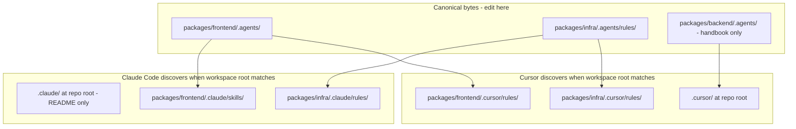
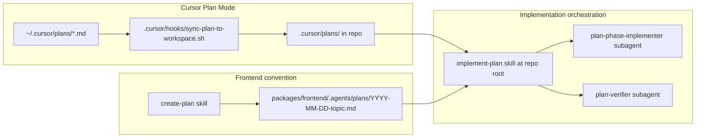

# Agent & Cursor configuration — how scoping and discovery work

## Short answer

**Yes, content is scoped per package** (`packages/frontend/.agents/`, `packages/infra/.agents/`, etc.) with **symlink pointers** under each package’s `.cursor/` and `.claude/`.

**No, the monorepo root does not fully “discover” package-scoped rules the same way.** At repo root you get repo-wide Cursor config + backend rules + cross-cutting skills/hooks; frontend and infra **`.mdc` rules only auto-load when you open that package as the workspace root**.

**Skills are more discoverable at root than rules** — frontend skills under `.agents/skills/` still show up in Cursor’s skill list from the monorepo workspace (you can see them in this session), but frontend **rules** require opening [`packages/frontend/`](packages/frontend/) for reliable auto-loading.

---

## Canonical source vs editor pointers



| Package | Canonical home | Cursor pointer | Claude pointer |
| --- | --- | --- | --- |
| **Frontend** | [`packages/frontend/.agents/`](packages/frontend/.agents/) (rules, skills, plans, AGENTS.md) | [`packages/frontend/.cursor/rules/`](packages/frontend/.cursor/rules/) → symlinks to `.agents/rules/` | [`packages/frontend/.claude/skills/`](packages/frontend/.claude/skills/) → symlinks to `.agents/skills/` |
| **Infra** | [`packages/infra/.agents/rules/`](packages/infra/.agents/rules/) | [`packages/infra/.cursor/rules/`](packages/infra/.cursor/rules/) | [`packages/infra/.claude/rules/`](packages/infra/.claude/rules/) |
| **Backend** | [`packages/backend/.agents/`](packages/backend/.agents/) (handbook + library only — no skills/rules folders) | **No package `.cursor/`** — rules live at repo root | No package skills — [`CLAUDE.md`](CLAUDE.md) at root |
| **Repo-wide** | [`AGENTS.md`](AGENTS.md), [`CLAUDE.md`](CLAUDE.md) | [`.cursor/rules/`](.cursor/rules/) | [`.claude/README.md`](.claude/README.md) (no skills dir) |

**Windows / no symlinks:** run [`scripts/sync-agents-pointers.sh`](scripts/sync-agents-pointers.sh) to materialize copies instead of symlinks (frontend rules + Claude skills; infra rules for both Cursor and Claude).

---

## What loads where (Cursor)

### Monorepo root workspace (`/conqr`)

Documented in [`.cursor/README.md`](.cursor/README.md):

| Loads automatically | Does **not** auto-load from package pointers |
| --- | --- |
| [`branch-policy.mdc`](.cursor/rules/branch-policy.mdc) (`alwaysApply: true`) | All 17 frontend `.mdc` rules in `packages/frontend/.cursor/rules/` |
| Backend rules in [`.cursor/rules/backend-*.mdc`](.cursor/rules/) (glob: `packages/backend/src/**/*.ts`) | Infra rules in `packages/infra/.cursor/rules/` |
| MCP / CLI config | |
| Repo-root skills: [`implement-plan`](.cursor/skills/implement-plan/SKILL.md), [`code-review`](.cursor/skills/code-review/SKILL.md), [`documentation-update`](.cursor/skills/documentation-update/SKILL.md), [`strict-app-wide-review`](.cursor/skills/strict-app-wide-review/SKILL.md) | |
| Hooks + plan mirror: [`.cursor/hooks.json`](.cursor/hooks.json) → [`.cursor/plans/`](.cursor/plans/) | |
| Subagents: [`plan-phase-implementer`](.cursor/agents/plan-phase-implementer.md), [`plan-verifier`](.cursor/agents/plan-verifier.md), [`docs-impact-reviewer`](.cursor/agents/docs-impact-reviewer.md) | |
| Always-in-context docs: [`AGENTS.md`](AGENTS.md), [`CLAUDE.md`](CLAUDE.md) | |

**Frontend skills** under [`packages/frontend/.agents/skills/`](packages/frontend/.agents/skills/) are still **indexed/discoverable** at monorepo root (this session lists them). Agents can `Read` them on demand even when frontend rules are not auto-injected.

**Practical implication:** cross-package work at repo root is fine for backend + plan orchestration; for frontend-heavy work, open **`packages/frontend/`** as the workspace so all `.mdc` rules (design-system, no-god-files, expo-dev-client, etc.) fire reliably.

### `packages/frontend/` workspace

Per [`packages/frontend/.cursor/README.md`](packages/frontend/.cursor/README.md):

- Full frontend rule set via symlinks in `packages/frontend/.cursor/rules/`
- Rule **globs are repo-rooted** (e.g. `packages/frontend/**/*.{ts,tsx}`) — correct even when Git root is the monorepo
- Repo-wide `branch-policy.mdc` still applies (lives at monorepo root, not duplicated)

### `packages/infra/` workspace

Same pattern: infra rules load; repo-wide branch policy still applies.

---

## Two plan systems (recent plan skill + hooks)

These serve **different purposes** and are **not duplicates**:



| Track | Entry | Output location | Used for |
| --- | --- | --- | --- |
| **Cursor Plan Mode + hook** | Plan Mode UI / agent writes to `~/.cursor/plans/` | Mirrored to [`.cursor/plans/`](.cursor/plans/) via [`hooks.json`](.cursor/hooks.json) | Ephemeral agent plans, team-visible copies in git, input to [`implement-plan`](.cursor/skills/implement-plan/SKILL.md) |
| **Frontend `create-plan` skill** | [`packages/frontend/.agents/skills/create-plan/SKILL.md`](packages/frontend/.agents/skills/create-plan/SKILL.md) | [`packages/frontend/.agents/plans/`](packages/frontend/.agents/plans/) from [`TEMPLATE.md`](packages/frontend/.agents/plans/TEMPLATE.md) | Dated frontend refactor/feature plans per AGENTS.md workflow |

[`implement-plan`](.cursor/skills/implement-plan/SKILL.md) lives **only at repo root** (`disable-model-invocation: true` — user must invoke explicitly). It spawns [`plan-phase-implementer`](.cursor/agents/plan-phase-implementer.md) and [`plan-verifier`](.cursor/agents/plan-verifier.md), which reference frontend Claude skill paths for frontend phases.

---

## Claude Code and other agents

### Claude Code

| Workspace root | What Claude loads |
| --- | --- |
| **Monorepo root** | [`CLAUDE.md`](CLAUDE.md), [`AGENTS.md`](AGENTS.md), [`.claude/README.md`](.claude/README.md) — **no** `.claude/skills/` at root |
| **`packages/frontend/`** | All skills via [`packages/frontend/.claude/skills/`](packages/frontend/.claude/skills/) symlinks + frontend rules via `.cursor/rules/` if using Cursor |
| **`packages/infra/`** | Infra rules via [`packages/infra/.claude/rules/`](packages/infra/.claude/rules/) |

Expo upstream skills are installed into `.agents/skills/` via `pnpx skills` from `packages/frontend/` ([`skills-lock.json`](packages/frontend/skills-lock.json)); both Cursor and Claude discover them through the pointer trees.

### Optional: TanStack Intent

[`packages/frontend/AGENTS.md`](packages/frontend/AGENTS.md) (short stub, not the full handbook) documents a **second** skill discovery path:

```bash
pnpx @tanstack/intent@latest list
pnpx @tanstack/intent@latest load <package>#<skill>
```

This is **runtime/on-demand**, separate from Cursor’s static skill index and separate from `pnpx skills` (Expo bundle installer).

### Cursor subagents (Task tool)

Defined at repo root in [`.cursor/agents/`](.cursor/agents/):

- `plan-phase-implementer` — implements one phase from a plan file
- `plan-verifier` — checks acceptance criteria against the diff
- `docs-impact-reviewer` — doc impact analysis

These are **Cursor-specific**; Claude Code does not use this folder.

---

## Intentional asymmetry (backend vs frontend)

| Concern | Backend | Frontend |
| --- | --- | --- |
| Rules location | Repo root [`.cursor/rules/backend-*.mdc`](.cursor/rules/) | Package [`packages/frontend/.cursor/rules/`](packages/frontend/.cursor/rules/) |
| Loads at monorepo root when editing that code? | **Yes** (glob-triggered) | **No** (need frontend workspace or manual rule reading) |
| Handbook | [`packages/backend/.agents/AGENTS.md`](packages/backend/.agents/AGENTS.md) + root [`CLAUDE.md`](CLAUDE.md) | [`packages/frontend/.agents/AGENTS.md`](packages/frontend/.agents/AGENTS.md) |
| Skills | None formalized | 20+ in `.agents/skills/` |

This matches the repo’s stated convention in [`AGENTS.md`](AGENTS.md): backend guardrails are cross-cutting at root; frontend agent library is package-local.

---

## Recommended workspace choice

| Task | Open as workspace |
| --- | --- |
| Backend API, cross-package PR, plan implement/verify | **Monorepo root** |
| Expo / RN feature work, design-system rules, frontend refactors | **`packages/frontend/`** |
| SST / Fly / infra deploy | **`packages/infra/`** |

For monorepo-root sessions doing frontend edits: agents can still **read** [`packages/frontend/.agents/AGENTS.md`](packages/frontend/.agents/AGENTS.md) and skills manually, but you lose automatic `.mdc` rule injection unless you switch workspace or rely on the agent following AGENTS.md from always-applied context.

---

## Gaps / doc nit (informational only — no changes requested)

- [`.cursor/README.md`](.cursor/README.md) line 40 says monorepo root loads “`branch-policy.mdc` + MCP/CLI only” — it omits that **backend `backend-*.mdc` rules** also live at root and glob-load on backend file edits.
- Root README also omits repo-root **skills**, **hooks**, and **subagents** that clearly exist and load in this session.

No code changes needed unless you want to align those README tables with actual behavior.
