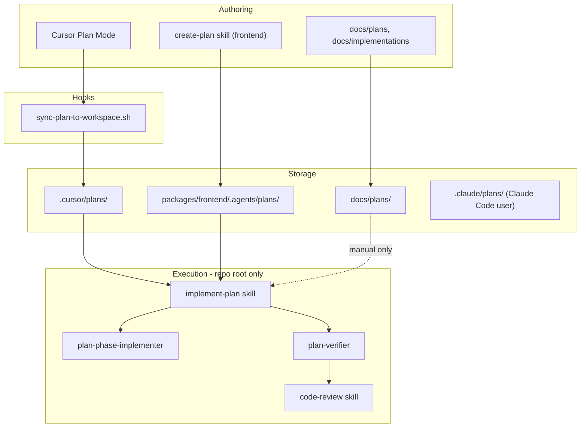
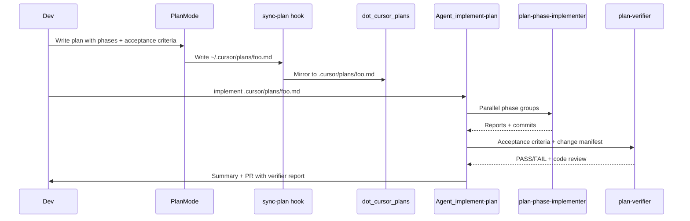

# Planning workflow audit

## Short answer

**Yes — `create-plan` is effectively legacy for authoring.** It is **frontend-only** ([`packages/frontend/.agents/skills/create-plan/SKILL.md`](packages/frontend/.agents/skills/create-plan/SKILL.md)). The **current execution path** is the repo-root pipeline:

- [`implement-plan`](.cursor/skills/implement-plan/SKILL.md) → [`plan-phase-implementer`](.cursor/agents/plan-phase-implementer.md) → [`plan-verifier`](.cursor/agents/plan-verifier.md)

**No other hooks** trigger implementers. The only project hook mirrors Plan Mode output into git.

---

## What exists today (four separate “plan” systems)

| Location | Purpose | Wired to `implement-plan`? |
|---|---|---|
| [`.cursor/plans/`](.cursor/plans/) | Plan Mode mirror (git-visible) | **Yes** — intended input |
| [`packages/frontend/.agents/plans/`](packages/frontend/.agents/plans/) | Dated frontend refactor plans (`create-plan` + ROADMAP god-file refs) | **Yes** — any `.md` path works |
| [`docs/plans/`](docs/plans/) | Product/system design docs (Prisma, territory, etc.) | No — human docs, not agent pipeline |
| [`docs/implementations/`](docs/implementations/) | Feature implementation write-ups | No |
| [`.claude/plans/`](.claude/plans/) | Claude Code session artifacts | No — unrelated to Cursor hooks |

**Backend:** no `create-plan`, no `implement-plan`, no `.agents/plans/`. [`AGENTS.md`](AGENTS.md) says “per backend convention” but none is defined.

---

## Hooks inventory

Only one hook in [`.cursor/hooks.json`](.cursor/hooks.json):

| Hook | Trigger | Action |
|---|---|---|
| `afterFileEdit` + matcher `Write` | Agent writes under `~/.cursor/plans/` | Copy to [`.cursor/plans/`](.cursor/plans/) via [`sync-plan-to-workspace.sh`](.cursor/hooks/sync-plan-to-workspace.sh) |

**Does not:** start implementation, run `pod install`, or invoke subagents.

---

## Global implementer pipeline (repo root)

All live under [`.cursor/`](.cursor/) — **not** symlinked into [`packages/frontend/.cursor/`](packages/frontend/.cursor/) (which only symlinks frontend rules).

| Artifact | Role |
|---|---|
| [`implement-plan/SKILL.md`](.cursor/skills/implement-plan/SKILL.md) | Orchestrator: parse phases, spawn implementers, spawn verifier, fix loop, PR summary |
| [`plan-phase-implementer.md`](.cursor/agents/plan-phase-implementer.md) | Subagent: implement one phase/group, commit, structured report |
| [`plan-verifier.md`](.cursor/agents/plan-verifier.md) | Subagent: diff vs `develop`, acceptance criteria table, calls `/code-review` |
| [`code-review/SKILL.md`](.cursor/skills/code-review/SKILL.md) | Called **by** plan-verifier (not a separate hook) |
| [`.github/pull_request_template.md`](.github/pull_request_template.md) | Slot for verifier report |

**Invocation:** from Agent mode at **monorepo root**, e.g. “implement `.cursor/plans/my-plan.md`” or `/implement-plan`.

**Workspace caveat:** [`.cursor/README.md`](.cursor/README.md) recommends opening `packages/frontend/` for Expo work, but `implement-plan` lives at repo root. For full pipeline + frontend rules, either:
- open **monorepo root** when implementing a plan, or
- manually `@`-reference the plan file and ask the agent to follow `implement-plan` (skill may not auto-load in frontend workspace).

---

## What still references `create-plan` (frontend-only, still “active” in docs)

Not deleted — still enforced by frontend agent config:

- [`packages/frontend/.agents/skills/create-plan/SKILL.md`](packages/frontend/.agents/skills/create-plan/SKILL.md)
- [`packages/frontend/.agents/rules/conqr-refactor-session.mdc`](packages/frontend/.agents/rules/conqr-refactor-session.mdc) — lists `create-plan` as primary procedure
- [`packages/frontend/.agents/AGENTS.md`](packages/frontend/.agents/AGENTS.md) — “write plan in `.agents/plans/`”
- [`packages/frontend/.agents/ROADMAP.md`](packages/frontend/.agents/ROADMAP.md) — god-file table links to dated plans there
- [`packages/frontend/.agents/conqr-frontend-library.md`](packages/frontend/.agents/conqr-frontend-library.md)

**Nothing in backend or infra references `create-plan` or `implement-plan`.**

[` .cursor/plans/README.md`](.cursor/plans/README.md) still says workspace plans are “not a substitute” for frontend dated plans — that is the main doc conflict with your intended direction.

---

## Recommended canonical workflow (replacing `create-plan`)

1. **Author:** Cursor Plan Mode (not `create-plan`)
2. **Sync:** automatic via hook → `.cursor/plans/`
3. **Execute:** `implement-plan` at repo root
4. **Verify:** `plan-verifier` output → PR template

Keep [`packages/frontend/.agents/plans/`](packages/frontend/.agents/plans/) as **historical archive** and ROADMAP god-file links unless/until those rows are migrated.

---

## Optional consolidation (if you want a follow-up PR)

Small doc/config alignment — no code changes required for the pipeline itself:

1. **Deprecate `create-plan` skill** — add a one-line redirect in [`create-plan/SKILL.md`](packages/frontend/.agents/skills/create-plan/SKILL.md): “Use Plan Mode + `implement-plan` instead.”
2. **Update [`conqr-refactor-session.mdc`](packages/frontend/.agents/rules/conqr-refactor-session.mdc)** — replace `create-plan` with Plan Mode + `.cursor/plans/` + `implement-plan`.
3. **Update [`.cursor/plans/README.md`](.cursor/plans/README.md)** — make `.cursor/plans/` the canonical location; frontend `.agents/plans/` = archive.
4. **Update [`AGENTS.md`](AGENTS.md) / [`packages/frontend/.agents/AGENTS.md`](packages/frontend/.agents/AGENTS.md)** — point non-trivial work at Plan Mode + implement-plan instead of `create-plan`.
5. **Optional:** symlink or document that `implement-plan` requires **monorepo root** workspace (or add a pointer in [`packages/frontend/.cursor/README.md`](packages/frontend/.cursor/README.md)).

No new hooks needed — the sync hook already supports the authoring side.
